# Project_template

Тип: Материал
Родитель: Описание проекта для 11 когорты (https://www.notion.so/11-03abbbbc8bcb49ed9b85c9b6d1174056?pvs=21)

# Задание 1. Анализ и планирование

### 1. Функциональные возможности единой платформы

**Контроль климатических систем**  
Пользователям доступно дистанционное управление обогревательными системами с возможностью активации/деактивации и мониторинга температурных показателей в реальном времени. Взаимодействие между центральным сервером и терминалами осуществляется через прямые синхронные команды.

**Анализ температурных данных**  
Интеграция веб-интерфейса позволяет отслеживать актуальные показатели микроклимата помещений. Сбор метрик реализован через прямые синхронные запросы к сенсорным устройствам.

---

### 2. Особенности архитектурного решения

**Технологический стек**  
Бэкенд: Java (Spring Framework)  
Хранилище данных: PostgreSQL  
Архитектурный подход: Единая кодовая база, объединяющая UI-слой, бизнес-логику и DAL

**Ключевые характеристики**
- Линейная обработка входящих запросов
- Вертикальное масштабирование как единственный вариант увеличения производительности
- Процедура обновлений требует полной остановки сервиса

---

### 3. Доменная структура системы

| Домен                     | Контекстные границы                          |
|---------------------------|----------------------------------------------|
| Климатический контроль    | Регулировка отопительных контуров            |
| Осветительные системы     | Управление световыми приборами, сценарии     |
| Контроль доступа          | Шлагбаумы, автоматические ворота             |
| Видеонаблюдение           | Потоковая передача видео, архивация          |
| Реестр оборудования       | Регистрация девайсов, конфигурация профилей  |
| Идентификация             | Учётные записи, RBAC, 2FA                    |
| Оповещения                | Мультиканальные уведомления (SMS/Email/Push) |
| Монетизация               | Платежные операции, тарифные планы           |

---

### 4. Ограничения монолитной архитектуры

**Масштабируемость:**  
Неэффективное распределение ресурсов при неравномерной нагрузке на компоненты системы.

**Риски разработки:**  
Эффект "домино" при внесении изменений — модификация одного модуля может нарушить работу несвязанных компонентов.

**Цикл выпуска обновлений:**  
Длительные тестовые процедуры из-за необходимости полной регрессионной проверки после любых изменений.

**Организационные сложности:**  
Конфликты версий и бюрократические задержки при параллельной работе нескольких команд над единой кодовой базой.

### 5. Визуализация контекста системы — диаграмма С4

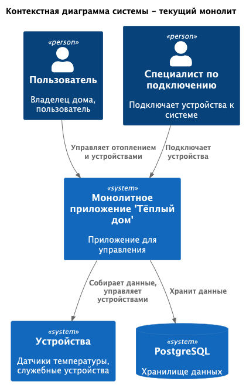
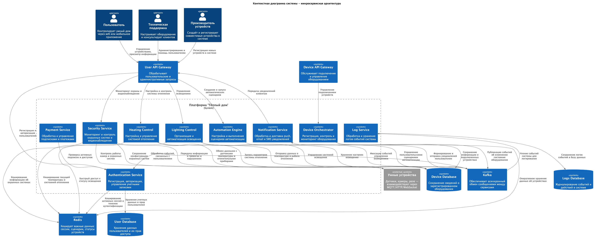

# Задание 2. Проектирование микросервисной архитектуры

**Диаграмма контейнеров**
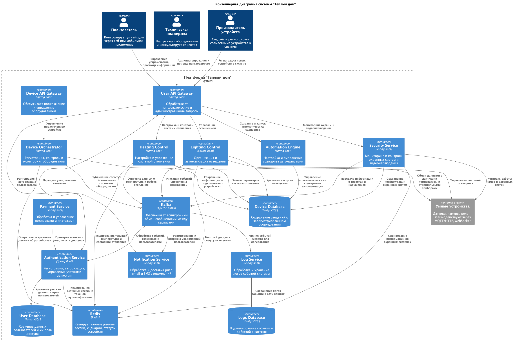

**Диаграмма компонентов**

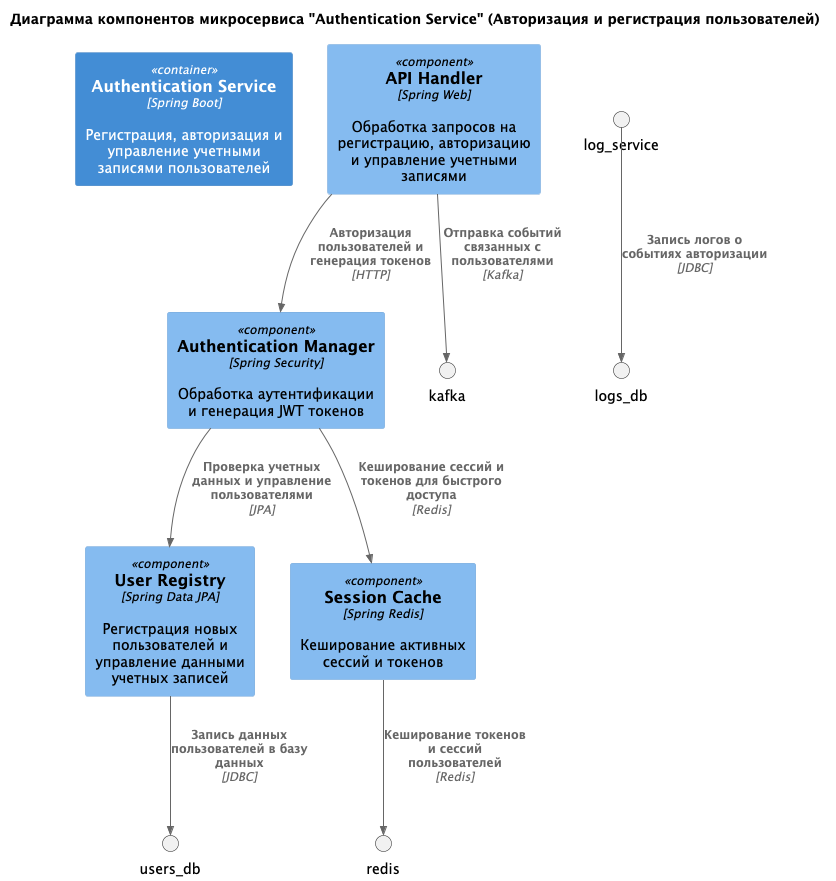
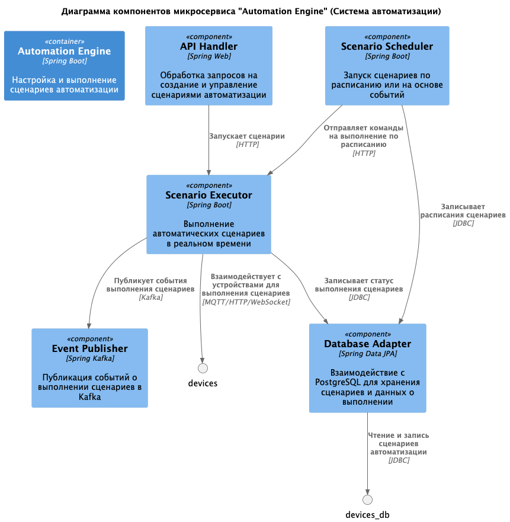
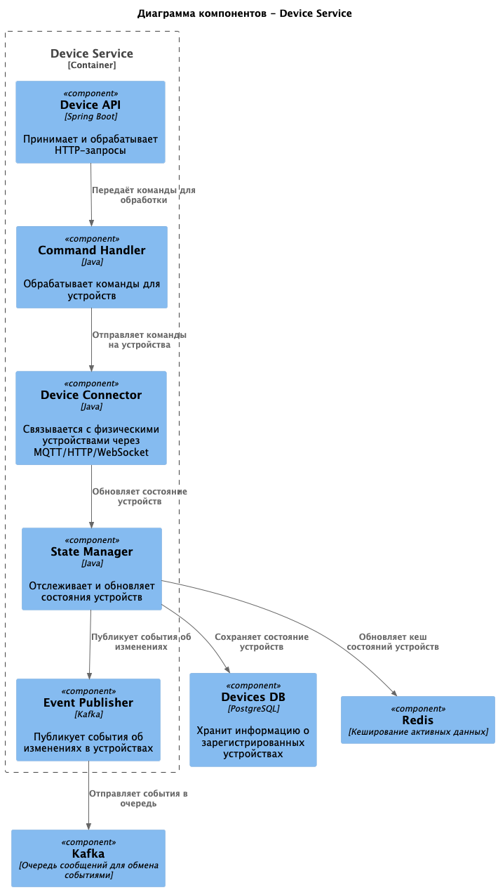
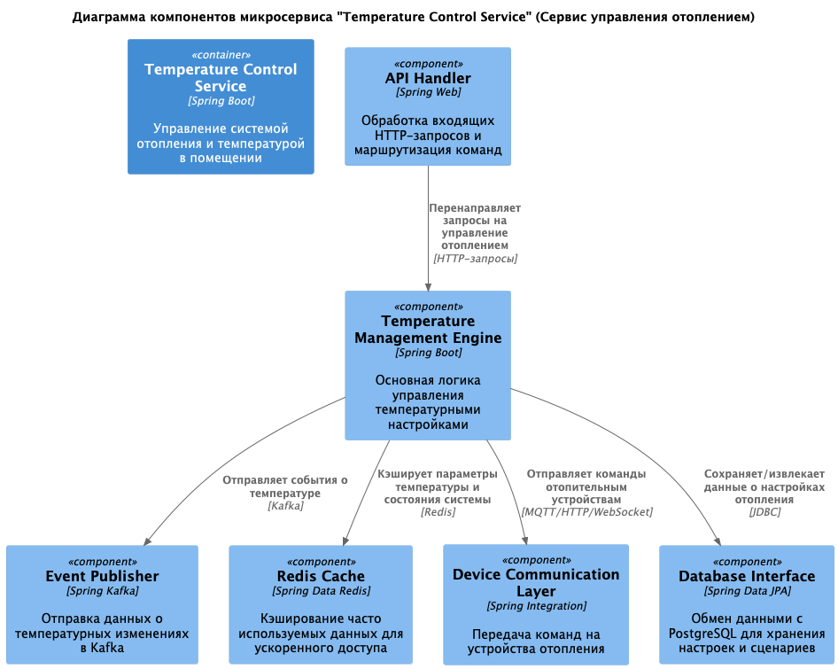
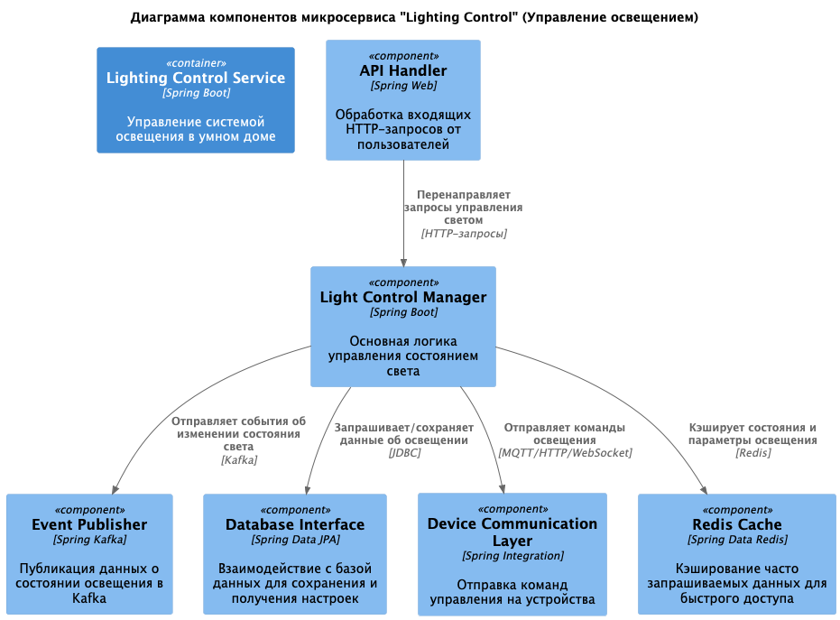
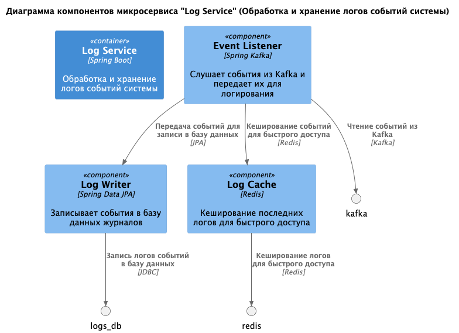
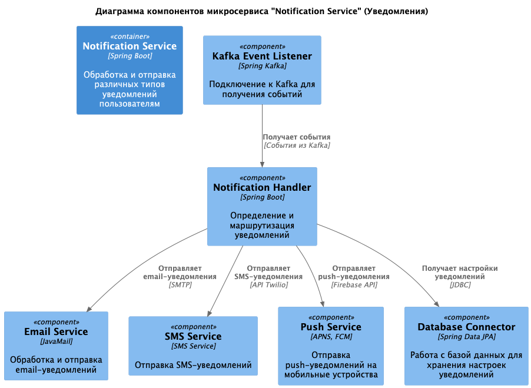
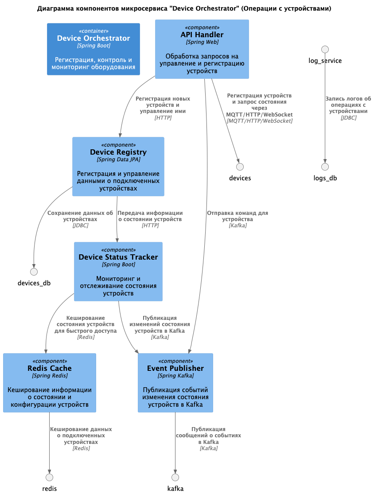
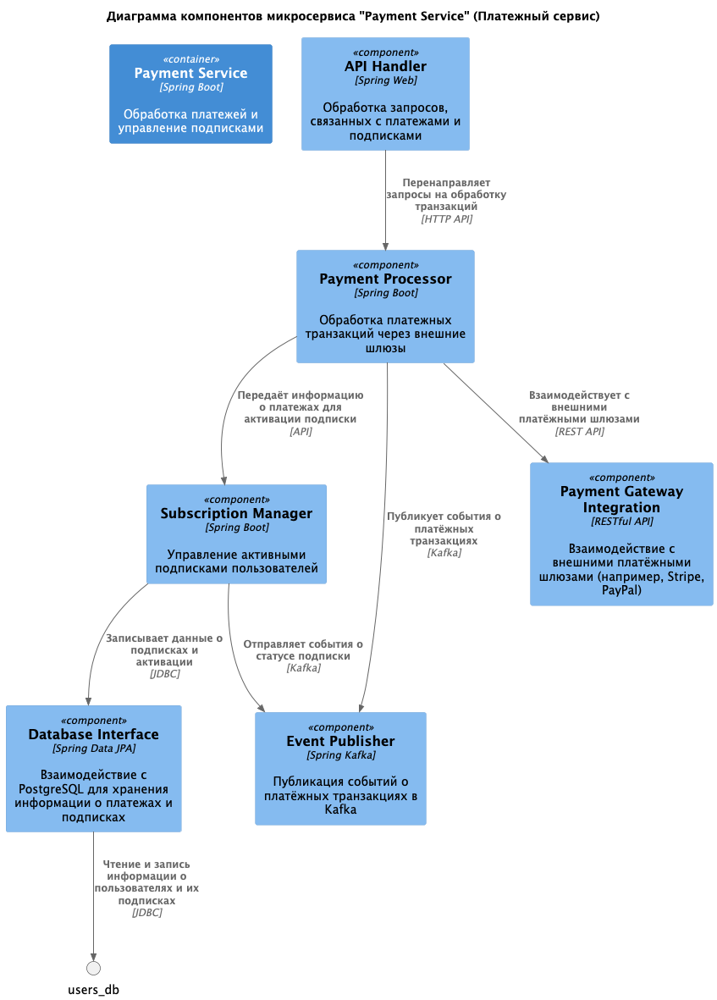
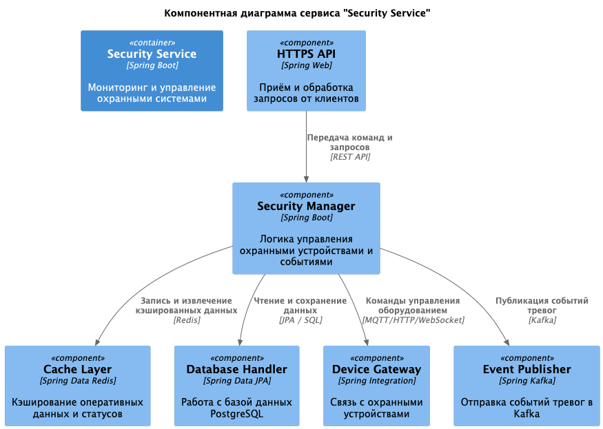

# Задание 3. Разработка ER-диаграммы

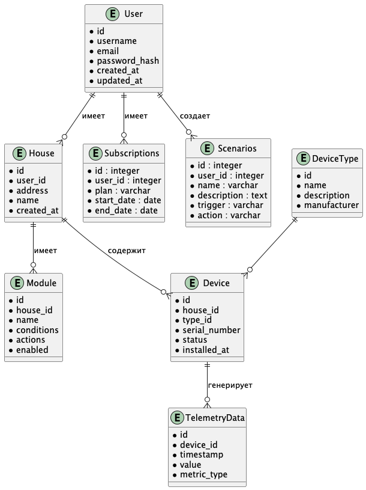

#  ❌ Задание 4. Создание и документирование API
